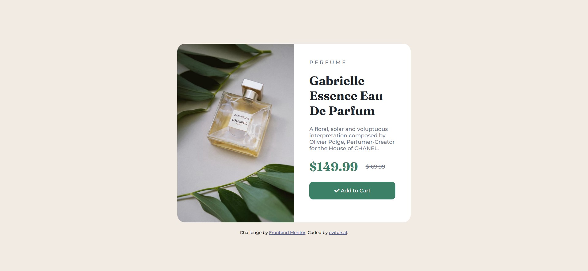
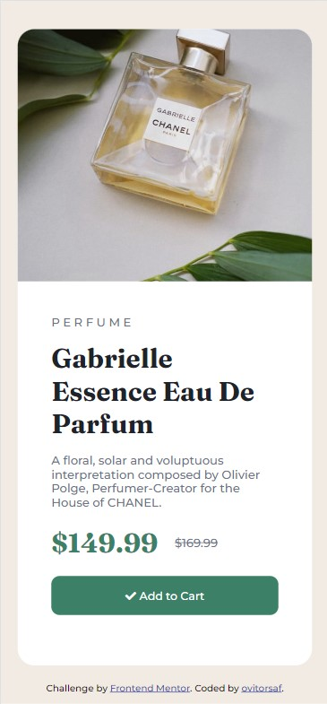

# Frontend Mentor - Product preview card component solution

This is a solution to the [Product preview card component challenge on Frontend Mentor](https://www.frontendmentor.io/challenges/product-preview-card-component-GO7UmttRfa). Frontend Mentor challenges help you improve your coding skills by building realistic projects. 

## Overview

### The challenge

Users should be able to:

- View the optimal layout depending on their device's screen size
- See hover and focus states for interactive elements

Desktop Design:


Mobile Design:


### Screenshots

This is my screenshots of my code on this project.


Desktop Screenshot


Mobile Screenshot


### Links

- Solution URL: [Código no GitHub](https://github.com/ovitorsaf/product-preview-card-component)
- Live Site URL: [Add live site URL here](https://your-live-site-url.com)

### Built with

- Html/CSS
- Flexbox

### What I learned

Aprendi um pouco mais sobre Flexbox e como podemos utilizar o flex-direction para posicionar os elementos um embaixo do outro mesmo no display flex, o que foi útil para o layout em mobile onde utilizei o flex-direction: column dentro do media query para o layout não quebrar e ficar identico ao proposto no design.

I learned a little more about Flexbox and how we can use flex-direction to position elements one below the other even in the flex display, which was useful for the mobile layout where I used 'flex-direction: column' within the media query for the layout does not break and is identical to the one proposed in the design.

```css

@media (max-width: 520px) {
    
    .card{
        display: flex;
        flex-direction: column;
        height: auto;
    }

    
    .left{
        width: 100%;
        height: 300px;
        border-radius: 20px 20px 0px 0px;
        background-position: center;
    }

    .right{
        width: 100%;
    }

    h1{
        margin-top: 15px;
        margin-bottom: 15px;
    }
    
  }
```

### Useful resources

- [Font Awesome](https://fontawesome.com/) - Foi usado para colocar o ícone no botão.

## Author

- Github - [Github](https://github.com/ovitorsaf)
- Frontend Mentor - [@ovitorsaf](https://www.frontendmentor.io/profile/ovitorsaf)
